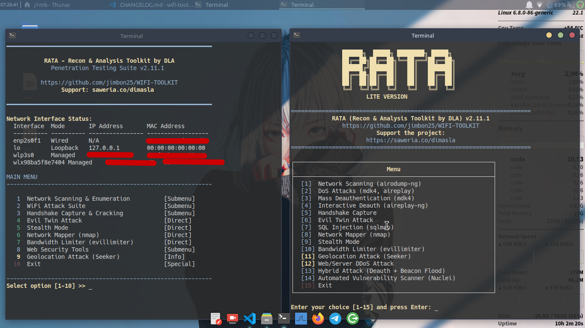

# WIFI-TOOLKIT - A WiFi Pentest Utility

<div align="center">


</div>

## Screenshots


### Table of Contents
*   [Disclaimer](#-disclaimer)
*   [Project Description](#project-description)
*   [Key Features](#key-features)
*   [Screenshots](#screenshots)
*   [Requirements](#requirements)
*   [Platform Support](#platform-support)
*   [Usage](#usage)
*   [Termux Support](#termux-support)
*   [Support the Project](#support-the-project)
*   [Accessing the Source Code](#accessing-the-source-code)
*   [Credits](#credits)
*   [License](#license)
*   [Changelog](CHANGELOG.md)
*   [User Guide (PANDUAN)](PANDUAN.md)
*   [Security Policy](SECURITY.md)

## ⚠️ Disclaimer
This tool is intended for educational and authorized security testing purposes only. The author is not responsible for any illegal or malicious use of this program. By using this software, you agree to take full responsibility for your actions. **Use at your own risk.**

## Project Description
WIFI-TOOLKIT is a comprehensive, menu-driven utility designed for Wi-Fi penetration testing. It simplifies complex network attacks and provides a user-friendly interface for performing network scanning, DoS attacks, handshake captures, and more.

## Key Features

**Note:** Many features of this toolkit, especially those related to scanning and attacking Wi-Fi networks, require a compatible wireless adapter that supports **monitor mode**.

*   **Wireless Interface Detection & Selection:** Automatically detects interfaces supporting monitor mode.
*   **MAC Address Spoofing:** Change your MAC address for anonymity.
*   **Monitor Mode Activation:** Easily switch your card to monitor mode.
*   **Automated Handshake Capture (WPA/WPA2):** Captures 4-way handshakes and saves them to the `handshakes/` folder.
*   **Network Scanning (airodump-ng):** Scans for Wi-Fi networks to identify APs and clients.
*   **Massive & Targeted Attacks:**
    *   **Deauthentication Attack (mdk4/aireplay-ng):** Broadcast or targeted deauth attacks.
    *   **Beacon Flood Attack (mdk4):** Create thousands of fake APs to disrupt network scanners.
*   **Evil Twin Attack:** Creates a fake AP mimicking a target network, with WPA2 support, to capture client traffic (requires 2 Wi-Fi adapters).
*   **Automated Vulnerability Assessment:** Analyzes and labels networks by vulnerability level.
*   **SQL Injection Automation (sqlmap):** A menu-driven `sqlmap` wrapper to automate database enumeration and exploitation, including a guided wizard for dumping data.
*   **Advanced Network Mapping (nmap):** Integrates `nmap` for in-depth network discovery, service fingerprinting, and automated vulnerability scanning via NSE scripts like `vulners`.
*   **Automated Vulnerability Scanner (Nuclei):** Integrates the powerful Nuclei scanner for customizable and template-based vulnerability scanning of web applications and services.
*   **Network Bandwidth Limiter (Evil Limiter):** Integrates the powerful Evil Limiter tool to monitor, analyze, and limit bandwidth of devices on your local network (requires a managed interface).
*   **Geolocation Attack (Seeker):** Automates the process of finding a target's location by generating a malicious link via `ngrok` and `Seeker`.
*   **UI/UX Improvements:** A clean, professional, and responsive menu-driven interface.
*   **Automatic Cleanup:** Restores all network settings upon exit.

---

## Requirements
This tool depends on several external command-line utilities. Ensure they are installed on your Debian/Ubuntu-based system.

| Tool                                                       | Description                                       |
| ---------------------------------------------------------- | ------------------------------------------------- |
| [Aircrack-ng](https://www.aircrack-ng.org/)                | Essential suite for Wi-Fi security auditing.      |
| [MDK4](https://github.com/aircrack-ng/mdk4)                | Advanced Wi-Fi testing tool for DoS attacks.      |
| [Macchanger](https://github.com/alobbs/macchanger)         | Utility for viewing and manipulating MAC addresses. |
| [iw](https://wireless.wiki.kernel.org/en/users/documentation/iw) | A modern nl80211 based CLI configuration utility. |
| [hostapd](https://w1.fi/hostapd/)                         | User space daemon for AP and authentication servers. |
| [dnsmasq](https://thekelleys.org.uk/dnsmasq/doc.html)      | A lightweight DHCP and caching DNS server.        |
| [sqlmap](https://sqlmap.org/)                            | Automatic SQL injection and database takeover tool. |
| [Nmap](https://nmap.org/)                                  | The Network Mapper for discovery and security auditing. |
| [Nuclei](https://nuclei.sh/)                               | Fast and customizable vulnerability scanner.      |
| [Evil Limiter](https://github.com/bitbrute/evillimiter)    | Bandwidth limiter for local network devices.      |
| [Seeker](https://github.com/thewhiteh4t/seeker)            | Geolocation tool using a web server and ngrok.    |
| `php`, `ssh`                                               | Required by Seeker for server and tunneling.      |

You can install all requirements with the following command:
```bash
sudo apt update
sudo apt install aircrack-ng mdk4 macchanger iw hostapd dnsmasq iproute2 iptables evillimiter sqlmap nmap php ssh nuclei
```

## Platform Support
This tool is designed for and tested on **Linux-based operating systems** due to its heavy reliance on Linux-specific networking utilities (e.g., `airmon-ng`, `iptables`, `tc`).

For Windows users, it is recommended to run `wifiRATA` within a **Windows Subsystem for Linux (WSL)** environment to ensure all functionalities work as intended.

## Usage
It is recommended to run the compiled version to access all features. The Python script is a "lite" version with limited functionality.

1.  **Full Version (Recommended):**
    *   Download the `wifiRATA` executable from the [Releases page](https://github.com/jimbon25/WIFI-TOOLKIT/releases/latest).
    *   Make the file executable:
        ```bash
        chmod +x wifiRATA
        ```
    *   Run the tool with root privileges:
        ```bash
        sudo ./wifiRATA
        ```

2.  **Lite Version (Seeker Only):**
    *   Clone the repository or download the source code.
    *   Run the `rata_lite.py` script with root privileges:
        ```bash
        sudo python3 main/rata_lite.py
        ```

## Termux Support
Support for the Termux environment on Android is currently under development. A version compiled specifically for ARM architectures will be made available in a future release. Stay tuned!

## Support the Project

If you appreciate this tool and would like to support its development, consider buying me a coffee! Your support helps maintain and improve this project.

[Buy Me a Coffee on Saweria](https://saweria.co/dimasla)

## Credits

This project is built upon and integrates the following excellent open-source tools and projects:

- **[Evil Limiter](https://github.com/bitbrute/evillimiter)** - A powerful tool for monitoring, analyzing, and limiting bandwidth of devices on a local network. Thanks to [@bitbrute](https://github.com/bitbrute) for this exceptional work.

- **[Seeker](https://github.com/thewhiteh4t/seeker)** - An effective geolocation tool using a web server and ngrok tunneling. Our gratitude goes to [@thewhiteh4t](https://github.com/thewhiteh4t) for creating this tool.

- **[Aircrack-ng](https://www.aircrack-ng.org/)** - The industry-standard suite for Wi-Fi security auditing and testing. Essential foundation for WiFi penetration testing.

- **[MDK4](https://github.com/aircrack-ng/mdk4)** - Advanced Wi-Fi testing tool for DoS attacks and network testing capabilities.

- **[Nuclei](https://nuclei.sh/)** - A fast and customizable vulnerability scanner by [@projectdiscovery](https://github.com/projectdiscovery). Used for template-based vulnerability assessment.

- **[sqlmap](https://sqlmap.org/)** - Automatic SQL injection and database takeover tool. Essential for web application security testing.

- **[Nmap](https://nmap.org/)** - The Network Mapper for comprehensive network discovery and security auditing.

- **[Garuda-DOS-Toolkit](https://github.com/Aditya-dom/Garuda-DOS-Toolkit)** - A modular DDoS attack framework with support for HTTP Flood, Slowloris, Mixed attacks, and advanced evasion techniques. Used for enhanced web server DoS capabilities.

- **[Evil Twin Attack Concept](docs/evil_twin_guide.md)** - Inspired by common WiFi security testing methodologies.

## License
This project is licensed under the [Creative Commons Attribution-NonCommercial-ShareAlike 4.0 International License](http://creativecommons.org/licenses/by-nc-sa/4.0/).
