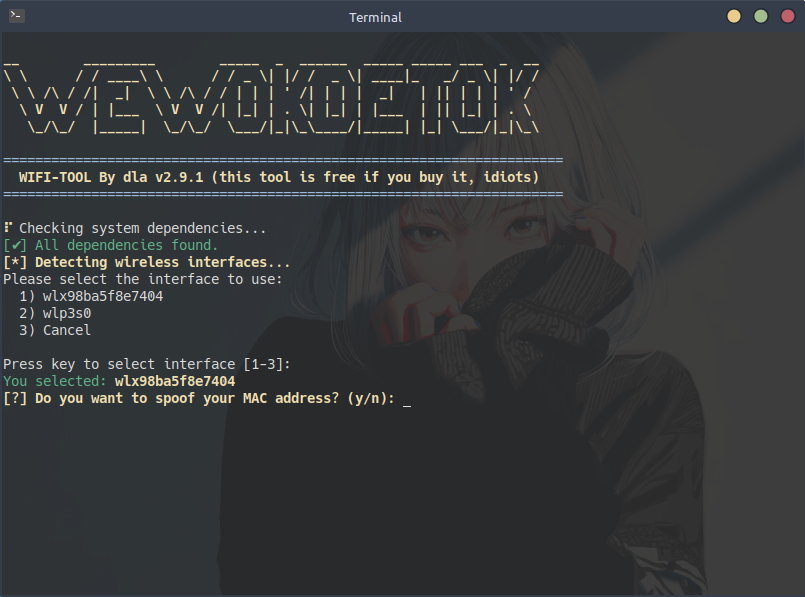
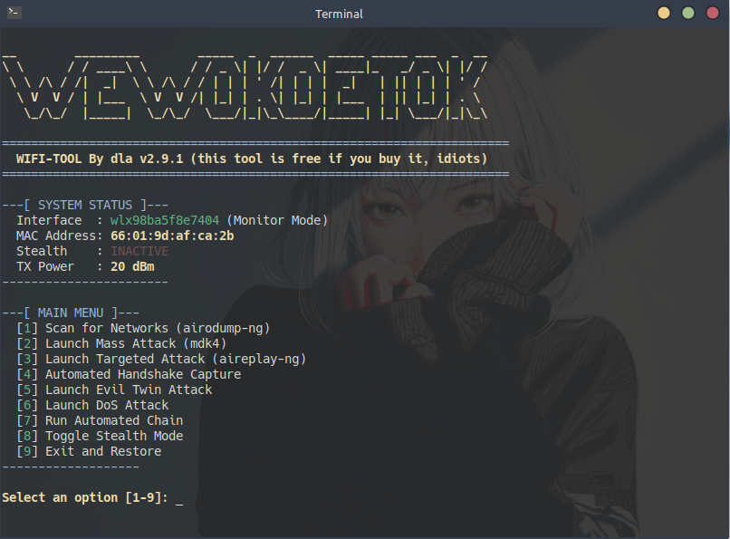

# WIFI-TOOLKIT - A WiFi Pentest Utility


## ⚠️ Disclaimer
This tool is intended for educational and authorized security testing purposes only. The author is not responsible for any illegal or malicious use of this program. By using this software, you agree to take full responsibility for your actions. **Use at your own risk.**

## Project Description
WIFI-TOOLKIT is a comprehensive, menu-driven utility designed for Wi-Fi penetration testing. It simplifies complex network attacks and provides a user-friendly interface for performing network scanning, DoS attacks, handshake captures, and more.

## Key Features
*   **Wireless Interface Detection & Selection:** Automatically detects interfaces supporting monitor mode.
*   **MAC Address Spoofing:** Change your MAC address for anonymity.
*   **Monitor Mode Activation:** Easily switch your card to monitor mode.
*   **Automated Handshake Capture (WPA/WPA2):** Captures 4-way handshakes and saves them to the `handshakes/` folder.
*   **Network Scanning (airodump-ng):** Scans for Wi-Fi networks to identify APs and clients.
*   **Massive & Targeted Attacks:**
    *   **Deauthentication Attack (mdk4/aireplay-ng):** Broadcast or targeted deauth attacks.
    *   **Beacon Flood Attack (mdk4):** Create thousands of fake APs to disrupt network scanners.
*   **Evil Twin Attack:** Creates a fake AP mimicking a target network, with WPA2 support, to capture client traffic (requires 2 Wi-Fi adapters).
*   **Automated Vulnerability Assessment:** Analyzes and labels networks by vulnerability level.
*   **UI/UX Improvements:** A clean, professional, and responsive menu-driven interface.
*   **Automatic Cleanup:** Restores all network settings upon exit.

## Screenshots



---

## Requirements
This tool depends on several external command-line utilities. Ensure they are installed on your Debian/Ubuntu-based system.

| Tool                                                       | Description                                       |
| ---------------------------------------------------------- | ------------------------------------------------- |
| [Aircrack-ng](https://www.aircrack-ng.org/)                | Essential suite for Wi-Fi security auditing.      |
| [MDK4](https://github.com/aircrack-ng/mdk4)                | Advanced Wi-Fi testing tool for DoS attacks.      |
| [Macchanger](https://github.com/alobbs/macchanger)         | Utility for viewing and manipulating MAC addresses. |
| [iw](https://wireless.wiki.kernel.org/en/users/documentation/iw) | A modern nl80211 based CLI configuration utility. |
| [hostapd](https://w1.fi/hostapd/)                         | User space daemon for AP and authentication servers. |
| [dnsmasq](https://thekelleys.org.uk/dnsmasq/doc.html)      | A lightweight DHCP and caching DNS server.        |

You can install all requirements with the following command:
```bash
sudo apt update
sudo apt install aircrack-ng mdk4 macchanger iw hostapd dnsmasq
```

## Usage
1.  Download the `wifiToolkit` executable from the [Releases page](https://github.com/jimbon25/WIFI-TOOLKIT/releases/tag/v2.9.1).
2.  Make the file executable:
    ```bash
    chmod +x wifiToolkit
    ```
3.  Run the tool with root privileges:
    ```bash
    sudo ./wifiToolkit
    ```

## Termux Support
Support for the Termux environment on Android is currently under development. A version compiled specifically for ARM architectures will be made available in a future release. Stay tuned!

## Support the Project

If you appreciate this tool and would like to support its development, consider buying me a coffee! Your support helps maintain and improve this project.

[Buy Me a Coffee on Saweria](https://saweria.co/dimasla)

## Accessing the Source Code

The compiled `wifiToolkit` executable is provided for convenience. If you wish to access the raw, uncompiled source code (Python files), it is available upon supporting the project.

Please consider supporting the development via the "Buy Me a Coffee" link above. After your contribution, you can contact us at `jimbonluis90@gmail.com` to request access to the source code.

## License
This project is licensed under the MIT License.